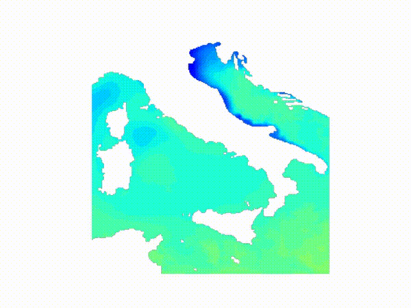
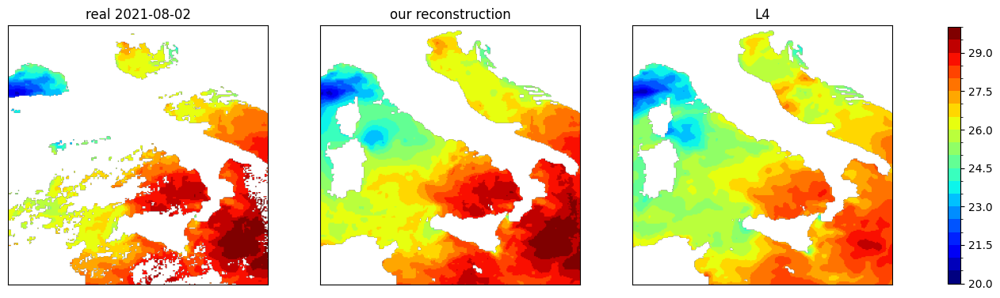
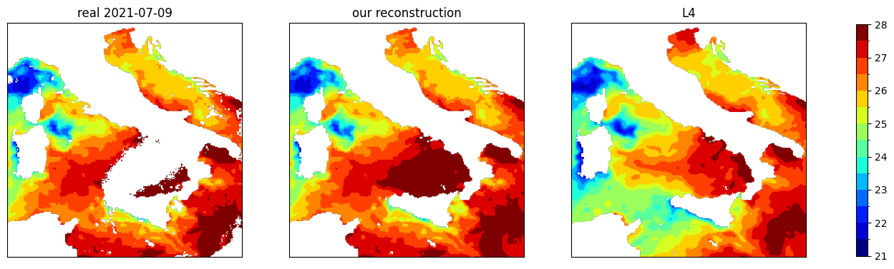
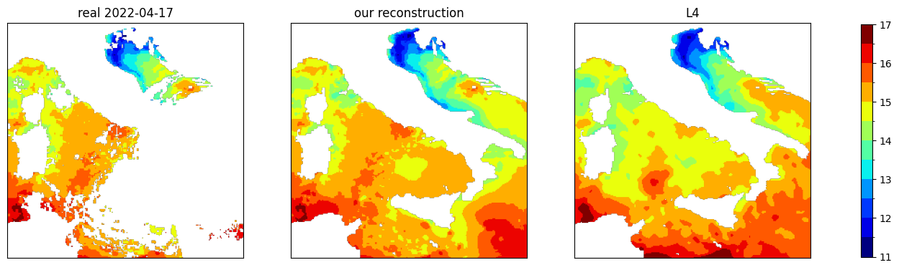
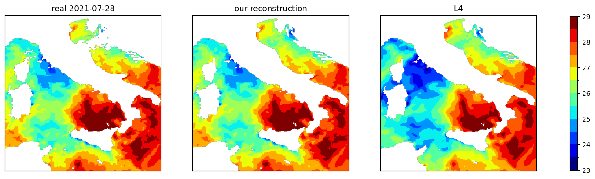

# Sea Surface Temperature reconstruction
A set of notebooks for Sea Surface Temperature (SST) re-analysis starting from infrared satellite signals.

The code is relative to the article [Deep Learning for Sea Surface Temperature Reconstruction under Cloud Occlusion](https://arxiv.org/abs/2412.03413), written in collaboration with Ali Aydogdu, Emanuela Clementi, Angelo Greco, Lorenzo Mentaschi, Fabio Merizzi, Pietro Miraglio, Paolo Oddo, Nadia Pinardi and Alessandro Testa.

The animation describes our reconstruction of SST temperature for the year 2022 relative to the Seas surrounding Italy.

___

Sea Surface Temperature (SST) is a vital parameter for understanding Earth’s oceans and climate system. Monitoring and analyzing SST is crucial for climate research, marine ecosystem studies, and insights into ocean circulation patterns. SST data are primarily collected by satellites detecting infrared radiation from the sea surface; however, cloud cover can absorb this radiation, creating significant observational gaps. Addressing these gaps is essential for effective data reanalysis. In this repository, we give a bunch of notebooks addressing the reconstruction task with Deep Learning technologies. 

For the sake of comparison with with previous models, we did experiments with two different sets of data:
* MODIS data, specifically, nightly data from the AQUA satellite
* L3S data from Copernicus

Data can be directly downloaded from the notebooks, or from MODIS and Copernicus sites.

## Notebooks and files
*  Code creting the climatology and residual data
*   Model definition and training, strating from l3s data. Comparison with Dincae
*  Model definition and training, strating from modis data. Comparison with Dincae
*  Comparison with Copernicus L4

___ 
## Examples 
Below we compare our reconstruction with the current Copernicus L4 data on a few samples:

